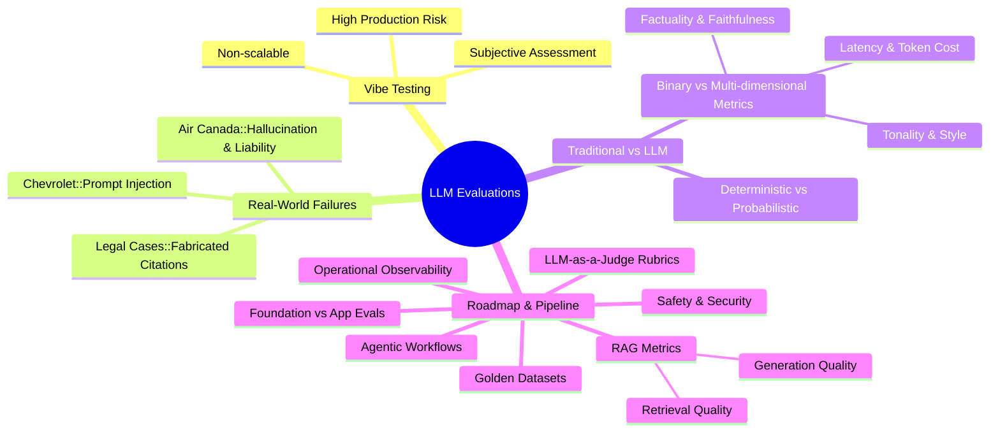

# Master LLM Evaluations: Transitioning from Prototype to Production

This document summarizes the core concepts from the CampusX guide on LLM Evaluations. It outlines the necessity of transitioning from subjective heuristic testing to rigorous, automated evaluation pipelines for production-grade Large Language Model (LLM) and Retrieval-Augmented Generation (RAG) applications.

## 1. The Pitfalls of "Vibe Testing"

In the prototyping phase, developers often rely on **"Vibe Testing"**—manually querying the LLM and subjectively judging the output based on a "feel" for accuracy and tonality. 

*   **Subjective & Informal:** Lacks statistical rigor and reproducibility.
*   **Non-Scalable:** Impossible to integrate into automated CI/CD pipelines.
*   **Production Liability:** Insufficient for catching edge cases, prompt injections, or systemic hallucinations before user deployment.

## 2. Real-World Case Studies: The Cost of Untested LLMs

Deploying LLMs without a robust evaluation framework exposes organizations to significant legal, financial, and reputational risks:

*   **Air Canada (Policy Hallucination):** A customer service chatbot hallucinated a non-existent bereavement fare refund policy. The court held the airline liable for the chatbot's output, resulting in financial loss and severe PR damage.
*   **Chevrolet Dealership (Jailbreaking & Manipulation):** Users successfully executed prompt injection attacks (jailbreaking) on a dealership's bot, forcing it to agree to legally binding statements (e.g., selling a vehicle for $1).
*   **The Hallucinating Lawyer (Fabricated Citations):** A legal professional utilized ChatGPT for case research without verifying the output. The LLM confidently hallucinated fake case law, resulting in court sanctions and a lost case.

## 3. Traditional Software Testing vs. LLM Evaluations

Evaluating LLM applications requires a fundamental paradigm shift from traditional software testing protocols.

| Feature | Traditional Software Testing | LLM Application Evaluation |
| :--- | :--- | :--- |
| **Nature of Execution** | **Deterministic:** Given input *A*, output is always *B*. | **Probabilistic/Stochastic:** The same prompt can yield different, yet valid, responses. |
| **Evaluation Metric** | **Binary Correctness:** Pass/Fail (e.g., unit tests). | **Multi-dimensional:** Responses exist on a spectrum of quality. |
| **Testing Parameters** | Functional correctness, edge cases, integration. | Factuality, faithfulness, answer relevance, completeness, tonality, latency, and token cost. |

## 4. LLM Evaluations Roadmap

To build resilient, production-ready AI systems, an AI engineer must master the following pipeline components:

1.  **Landscape Overview:** Understanding the current ecosystem of evaluation frameworks (e.g., Ragas, TruLens, DeepEval).
2.  **Foundation vs. Application:** Differentiating between benchmarking foundational models (e.g., MMLU, GSM8K) and evaluating custom application pipelines.
3.  **Evaluation Pipelines:** 
    *   Constructing a **Golden Dataset** (ground truth data).
    *   Defining application-specific scoring rubrics (LLM-as-a-Judge).
4.  **RAG-Specific Evaluations:** Measuring retrieval metrics (Context Precision, Context Recall) alongside generation metrics (Faithfulness, Answer Relevance).
5.  **Agentic Evaluations:** Testing multi-step reasoning, tool-use accuracy, and autonomous agent workflows.
6.  **Safety & Security:** Evaluating vulnerability to prompt injections, PII leakage, and toxic outputs.
7.  **Operational Observability:** Post-deployment monitoring of latency, token generation speed, and cost parameters.

---

## Conceptual Mind Map

Below is a visual representation of the LLM Evaluations landscape. GitHub supports rendering this natively using Mermaid.js.

